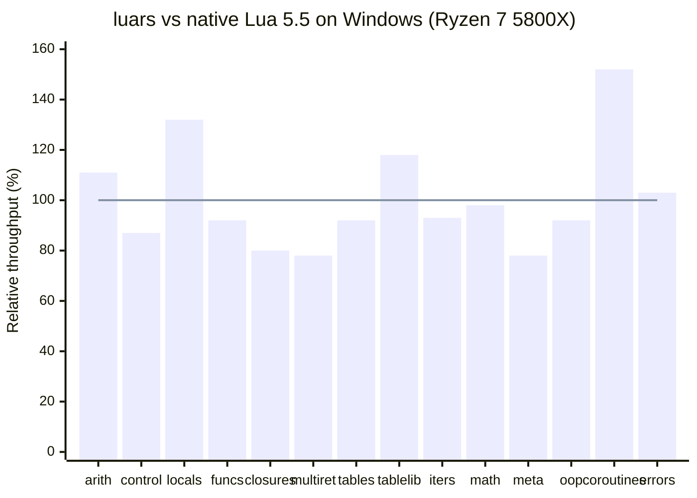

# luars

[](https://github.com/CppCXY/lua-rs/actions)
[](https://github.com/CppCXY/lua-rs/actions/workflows/lua_testes.yml)
[](LICENSE)
[](https://crates.io/crates/luars)

> **Note**: This is an **Lua 5.5** lib through AI-assisted programming.

luars is a pure Rust Lua 5.5 runtime and embedding toolkit. This repository contains the core library, a command-line interpreter, derive macros, debugger integration, and a WASM target.

The goal is not just to "run Lua", but to provide a practical embedding stack for Rust hosts: a typed-first API, derived UserData bindings, async bridging, multi-VM patterns, and browser-facing wasm-bindgen support.

## Repository Layout

| Path | Description |
|------|-------------|
| `crates/luars` | Core library crate: compiler, VM, GC, standard library, and embedding API |
| `crates/luars_interpreter` | CLI interpreter and bytecode disassembler |
| `crates/luars-derive` | Derive and attribute macros such as `LuaUserData` and `lua_methods` |
| `crates/luars_debugger` | `require("emmy_core")` debugger integration |
| `crates/luars_wasm` | Browser-targeted WASM wrapper and example pages |
| `docs/` | Embedding, UserData, async, and behavioral-difference documentation |
| `examples/` | Host integration examples closer to real applications |
| `benchmarks/` | Benchmark scripts used against Lua 5.5 |
| `lua_tests/testes` | Official Lua 5.5 test suite |

## Highlights

- Lua 5.5 compiler, bytecode VM, and GC implemented entirely in Rust
- Typed-first embedding API: prefer Rust types over raw `LuaValue` plumbing
- UserData derive macros for exposing fields, methods, operators, and constructors
- Async Rust functions bridged into Lua coroutines
- Lua strings keep byte-string semantics, with an optional UTF-8 view on the Rust side
- Optional `serde`, `sandbox`, and `shared-proto` features
- CLI, WASM, debugger integration, and multi-VM usage patterns

## Quick Start

### Use as a Library

```toml
[dependencies]
luars = "0.17"
```

```rust
use luars::{LuaVM, Stdlib};
use luars::lua_vm::SafeOption;

fn main() -> Result<(), Box<dyn std::error::Error>> {
    let mut vm = LuaVM::new(SafeOption::default());
    vm.open_stdlib(Stdlib::All)?;

    vm.register_function_typed("add", |a: i64, b: i64| a + b)?;

    let sum = vm.execute("return add(20, 22)")?[0]
        .as_integer()
        .unwrap_or_default();
    assert_eq!(sum, 42);
    Ok(())
}
```

For the full embedding API, see [crates/luars/README.md](crates/luars/README.md) and [docs/Guide.md](docs/Guide.md).

### Use as an Interpreter

```bash
cargo build --release -p luars_interpreter
```

This builds two executables:

- `target/release/lua`
- `target/release/bytecode_dump`

Typical usage:

```bash
./target/release/lua script.lua
./target/release/lua -i
./target/release/lua -e "print('hello')"
./target/release/bytecode_dump script.lua
```

## Documentation

| Document | Description |
|----------|-------------|
| [docs/Guide.md](docs/Guide.md) | Core embedding guide: execution, values, function registration, error handling, and API overview |
| [docs/UserGuide.md](docs/UserGuide.md) | UserData, derive macros, type registration, and conversions |
| [docs/Async.md](docs/Async.md) | Async API, coroutine bridging, and multi-VM patterns |
| [docs/Different.md](docs/Different.md) | Known behavioral differences from the official C Lua 5.5 implementation |
| [crates/luars_wasm/QUICKSTART.md](crates/luars_wasm/QUICKSTART.md) | WASM quick start |

## Examples

| Example | Description |
|---------|-------------|
| [examples/rules-engine-demo/README.md](examples/rules-engine-demo/README.md) | A business-style rules-engine embedding example: Rust owns host capabilities, Lua owns checkout policy |
| [examples/http-server](examples/http-server) | Async multi-VM HTTP server example |
| [examples/luars-example](examples/luars-example) | Basic embedding, UserData, and host API examples |
| [examples/rust-bind-bench](examples/rust-bind-bench) | Microbenchmarks for the Rust host binding path |

## Build And Validate

### Run the Test Suite

```bash
# Windows
.\run_lua_tests.ps1

# Linux / macOS
cd lua_tests/testes && ../../target/release/lua all.lua
```

The project is continuously validated against the official Lua 5.5 test suite. Tests that depend on the C API, `testC`, native module loading, or some debugger hooks are skipped as documented in [docs/Different.md](docs/Different.md).

### Run Benchmarks

```bash
# Windows
.\run_benchmarks.ps1

# Linux / macOS
./run_benchmarks.sh
```

The benchmark scripts cover arithmetic, control flow, coroutines, functions, iterators, metatables, strings, tables, and more. The README snapshot below comes from `run_benchmarks.ps1` on Windows with a Ryzen 7 5800X, comparing luars against native Lua 5.5 on the same machine.

On this project, Linux results are typically about 10% lower than the Windows snapshot below, while macOS tends to perform better on most workloads.

### Benchmark Snapshot

The chart below is a script-level summary from the current Windows run of `run_benchmarks.ps1`. Values are shown as `luars / native Lua * 100`, so `100` means parity with native Lua, `120` means luars is about 20% faster, and `80` means it is about 20% slower.



| Script | Relative throughput |
|--------|---------------------|
| `bench_arithmetic.lua` | 111% |
| `bench_control_flow.lua` | 87% |
| `bench_locals.lua` | 132% |
| `bench_functions.lua` | 92% |
| `bench_closures.lua` | 80% |
| `bench_multiret.lua` | 78% |
| `bench_tables.lua` | 92% |
| `bench_table_lib.lua` | 118% |
| `bench_iterators.lua` | 93% |
| `bench_math.lua` | 98% |
| `bench_metatables.lua` | 78% |
| `bench_oop.lua` | 92% |
| `bench_coroutines.lua` | 152% |
| `bench_errors.lua` | 103% |

String-heavy microbenchmarks are intentionally left out of the chart because several subtests complete too quickly on Windows timer resolution, which can produce distorted summary ratios. For full raw output, run `run_benchmarks.ps1` directly and inspect the per-subtest numbers.

## Cargo Features

| Feature | Description |
|---------|-------------|
| `serde` | Enable conversions between Lua values and serde / JSON data structures |
| `sandbox` | Enable sandbox APIs for environment isolation, capability injection, and instruction/time/memory limits |
| `shared-proto` | Enable shared function prototypes for multi-VM scenarios |

## Compatibility And Boundaries

luars aims for Lua 5.5 semantic compatibility, but it is not a drop-in ABI replacement for C Lua. The current boundaries are:

- No C API, and no direct loading of native C Lua modules
- `string.dump` / `load` use luars's own bytecode format
- On the Rust host side, `as_str()` only returns a text view for valid UTF-8; use `as_bytes()` / `create_bytes()` when exact bytes matter
- A few corners of `debug`, `io`, and `package` still differ from C Lua

See [docs/Different.md](docs/Different.md) for the full list of known differences.

## License

MIT. See [LICENSE](LICENSE).
