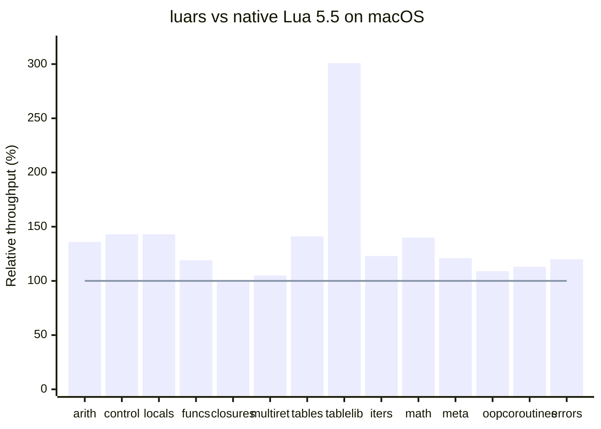

# macOS Benchmark Snapshot

This page summarizes the current macOS benchmark

Environment:
- Script runner: `run_benchmarks.sh`
- Platform: macOS
- Baseline: native Lua 5.5 on the same machine
- CPU: macOS Apple Silicon M4 (by @sniper00)

Method:
- Values are shown as `luars / native Lua * 100`
- `100` means parity with native Lua
- `120` means luars is about 20% faster
- `80` means luars is about 20% slower

| Script | Relative throughput |
|--------|---------------------|
| `bench_arithmetic.lua` | 136% |
| `bench_control_flow.lua` | 143% |
| `bench_locals.lua` | 143% |
| `bench_functions.lua` | 119% |
| `bench_closures.lua` | 99% |
| `bench_multiret.lua` | 105% |
| `bench_tables.lua` | 141% |
| `bench_table_lib.lua` | 301% |
| `bench_iterators.lua` | 123% |
| `bench_math.lua` | 140% |
| `bench_metatables.lua` | 121% |
| `bench_oop.lua` | 109% |
| `bench_coroutines.lua` | 113% |
| `bench_errors.lua` | 120% |

Highlights:
- The strongest macOS win in this run is `bench_table_lib.lua`, mainly because `table.insert`, `table.remove`, `table.sort`, and `table.move` all outperform native Lua by a large margin in the raw run.
- `bench_control_flow.lua`, `bench_locals.lua`, `bench_tables.lua`, and `bench_math.lua` also show broad wins across most subtests.
- `bench_closures.lua` is effectively at parity in this run.

String microbenchmarks from the same raw capture:
- `bench_strings.lua`: about 99%
- `bench_string_lib.lua`: about 120%
