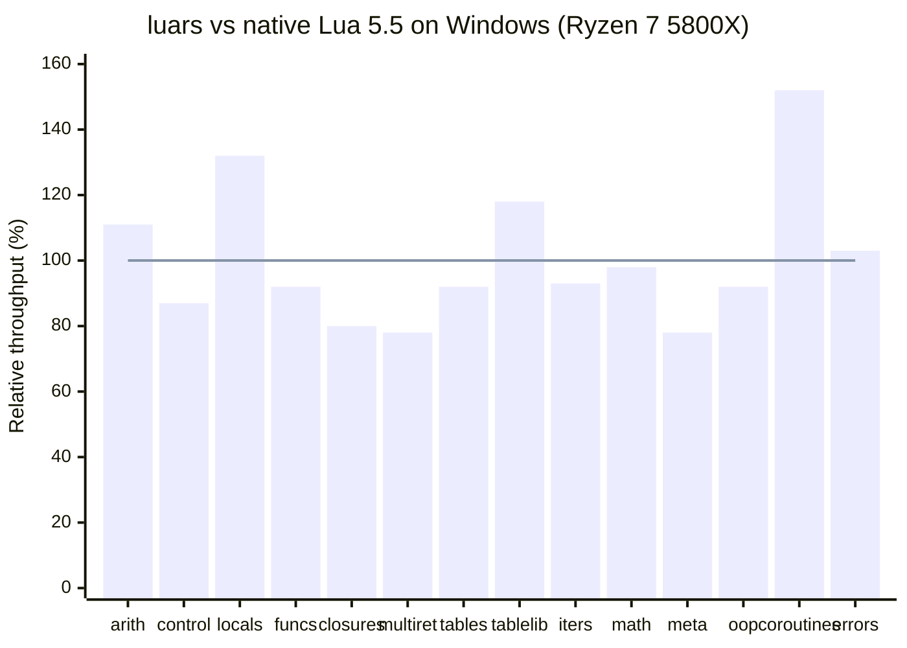

# Windows Benchmark Snapshot

This page contains the current Windows benchmark snapshot that used to live in the main README.

Environment:
- Script runner: `run_benchmarks.ps1`
- Platform: Windows
- CPU: Ryzen 7 5800X
- Baseline: native Lua 5.5 on the same machine

Method:
- Values are shown as `luars / native Lua * 100`
- `100` means parity with native Lua
- `120` means luars is about 20% faster
- `80` means luars is about 20% slower

| Script | Relative throughput |
|--------|---------------------|
| `bench_arithmetic.lua` | 111% |
| `bench_control_flow.lua` | 87% |
| `bench_locals.lua` | 132% |
| `bench_functions.lua` | 92% |
| `bench_closures.lua` | 80% |
| `bench_multiret.lua` | 78% |
| `bench_tables.lua` | 92% |
| `bench_table_lib.lua` | 118% |
| `bench_iterators.lua` | 93% |
| `bench_math.lua` | 98% |
| `bench_metatables.lua` | 78% |
| `bench_oop.lua` | 92% |
| `bench_coroutines.lua` | 152% |
| `bench_errors.lua` | 103% |

Notes:
- This is a script-level summary from the current Windows run of `run_benchmarks.ps1`.
- String-heavy microbenchmarks are intentionally left out of the chart because several subtests complete too quickly on Windows timer resolution, which can distort summary ratios.
- For full raw output, run `run_benchmarks.ps1` directly and inspect the per-subtest numbers.